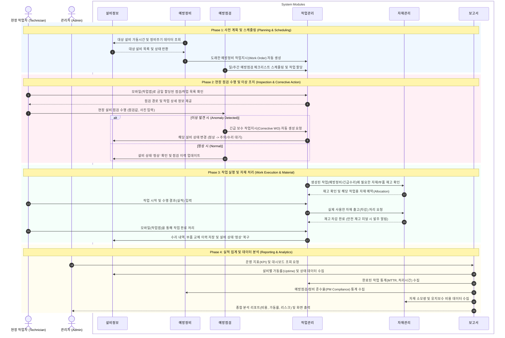

# 숙제 할 것 

```mermaid
sequenceDiagram
    autonumber
    actor Tech as 현장 작업자 (Technician)
    actor Admin as 관리자 (Admin)
    
    box System Modules
        participant Asset as 설비정보
        participant P_Maint as 예방정비
        participant P_Insp as 예방점검
        participant Work as 작업관리
        participant Material as 자재관리
        participant Report as 보고서
    end

    rect rgb(240, 248, 255)
    Note over Tech, Report: Phase 1: 사전 계획 및 스케줄링 (Planning & Scheduling)
    P_Maint->>Asset: 대상 설비 가동시간 및 정비주기 데이터 조회
    Asset-->>P_Maint: 대상 설비 목록 및 상태 반환
    P_Maint->>Work: 도래한 예방정비 작업지시(Work Order) 자동 생성
    P_Insp->>Work: 일/주간 예방점검 체크리스트 스케줄링 및 작업 할당
    end

    rect rgb(255, 240, 245)
    Note over Tech, Report: Phase 2: 현장 점검 수행 및 이상 조치 (Inspection & Corrective Action)
    Tech->>Work: 모바일(작업앱)로 금일 할당된 점검/작업 목록 확인
    Work-->>Tech: 점검 경로 및 작업 상세 정보 제공
    Tech->>P_Insp: 현장 설비 점검 수행 (점검값, 사진 입력)
    
    alt 이상 발견 시 (Anomaly Detected)
        P_Insp->>Work: 긴급 보수 작업지시(Corrective WO) 자동 생성 요청
        Work->>Asset: 해당 설비 상태 변경 (정상 -> 주의/수리 대기)
    else 정상 시 (Normal)
        P_Insp->>Asset: 설비 상태 '정상' 확인 및 점검 이력 업데이트
    end
    end

    rect rgb(245, 255, 250)
    Note over Tech, Report: Phase 3: 작업 실행 및 자재 처리 (Work Execution & Material)
    Work->>Material: 생성된 작업(예방정비/긴급수리)에 필요한 자재/부품 재고 확인
    Material-->>Work: 재고 확인 및 해당 작업용 자재 예약(Allocation)
    Tech->>Work: 작업 시작 및 수행 결과(실적) 입력
    Work->>Material: 실제 사용한 자재 출고(차감) 처리 요청
    Material-->>Work: 재고 차감 완료 (안전 재고 미달 시 발주 알림)
    Tech->>Work: 모바일(작업앱)을 통해 작업 완료 처리
    Work->>Asset: 수리 내역, 부품 교체 이력 저장 및 설비 상태 '정상' 복구
    end

    rect rgb(255, 253, 240)
    Note over Tech, Report: Phase 4: 실적 집계 및 데이터 분석 (Reporting & Analytics)
    Admin->>Report: 운영 지표(KPI) 및 대시보드 조회 요청
    Report->>Asset: 설비별 가동률(Uptime) 및 상태 데이터 수집
    Report->>Work: 완료된 작업 통계(MTTR, 처리시간) 수집
    Report->>P_Maint: 예방점검/정비 준수율(PM Compliance) 통계 수집
    Report->>Material: 자재 소모량 및 유지보수 비용 데이터 수집
    Report-->>Admin: 종합 분석 리포트(비용, 가동률, 리스크) 및 화면 출력
    end
```
